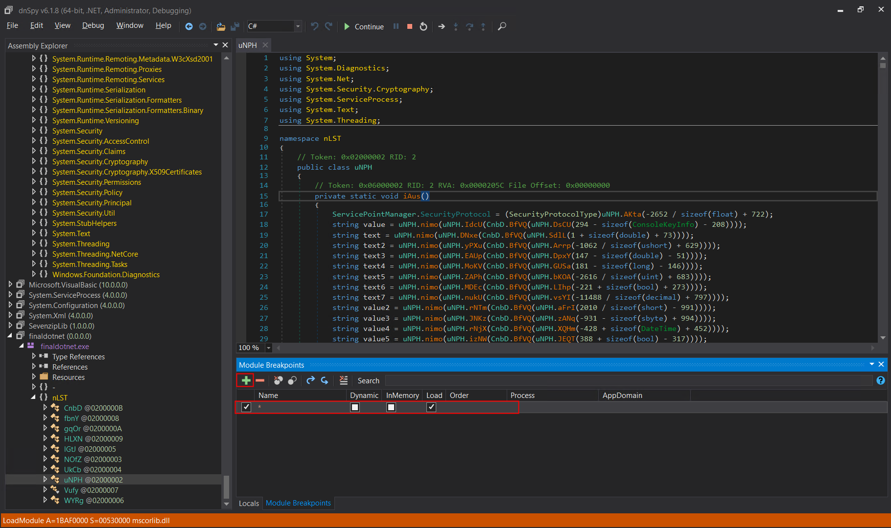
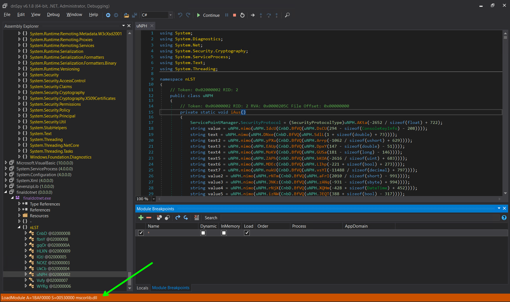
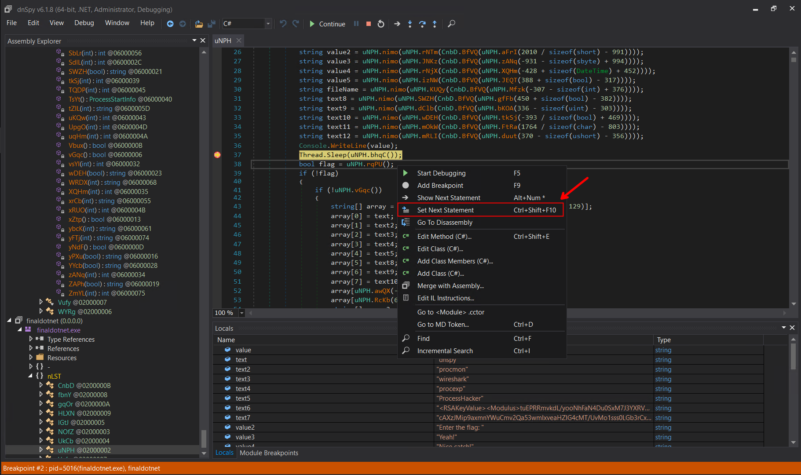
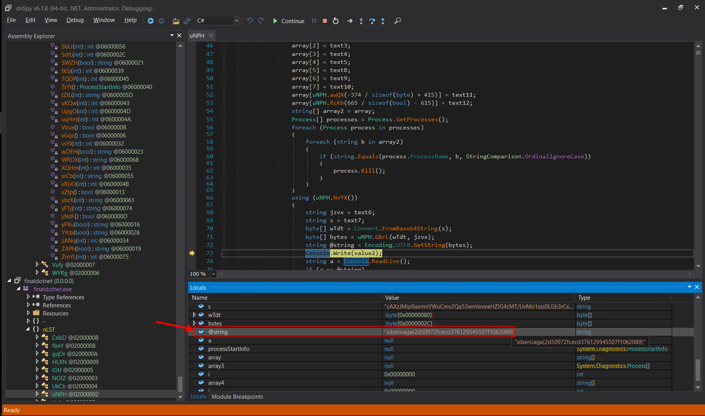

# packed (rev)

> This writeup is based on the challenge author explanation himself, Fareed Fauzi

## TL;DR

The author mentioned that this challenge is about `.NET` manual unpacking.

> Self assumption: It is packed because there are `Assembly` stuff and under `nLST.KMZdl.FXwnR`, there is `Assembly.Load` and under `nLST.sLcn.dEAB` function there is a variable named `entryPoint`

## Solution

Enable breakpoints on all modules:

- `Debug -> Windows -> Module Breakpoints`
- Add breakpoint, name = `*` (for all modules), enable `Dynamic`, `Inmemory`, and `Load`



Now start debugging the program. Notice on the bottom left hand corner, it logs what modules are loaded. We can ignore system related stuff `dll` like:

- `mscorlib.dll`
- `Microsoft.VisualBasic.dll` 
- `System.Core.dll`
- `System.dll`



Aside from the `dll` stuffs, initially, there are `finaldotnet.exe` and `SevenzipLib` modules being loaded. The first one is whatever as it is the executable itself (I suppose) and the second one is kind of interesting (this may be another sign of the executable being packed). However, we will just continue to observe what other modules are being loaded.

Immediately after `SevenzipLib` is loaded and we `continue` the execution, a module called `finaldotnet` is loaded (note the missing `.exe`). This is the unpacked executable. Next, we `step out` and notice that we are now at `nLST.KMZdl.FXwnR` function, specifically this line of code:

```cs
result = Assembly.Load(sLcn.Ptpi(array));
```

Then, we `step out` again to reach the `nLST.sLcn.dEAB` function. Inside this function, we could see that there is a variable called `entryPoint`, which is most probably belongs to the unpacked one. On line 99, we can see `entryPoint.Invoke(null, parameters)` and set a breakpoint here. This is probably where we start executing the unpacked version. After we `continue` and stop at the previous set breakpoint, we just do `step over` until there is a dialog box which tries to load something and we finally reach `nLST.uNPH.iAus` which is the `main` function of the unpacked executable.

There are lots of variable initializations and then `Thread.Sleep` is called. To bypass the `Thread.Sleep` function, we could just right click on the next line of code and select `Set Next Statement`.



There are lots of check (this could be skipped easily using `Set Next Statement`) and what we ultimately want to reach is this code block

```cs
using (uNPH.NvYX())
{
    string jzvx = text6;
    string s = text7;
    byte[] wTdt = Convert.FromBase64String(s);
    byte[] bytes = uNPH.GBrL(wTdt, jzvx);
    string @string = Encoding.UTF8.GetString(bytes);
    Console.Write(value2);
    string a = Console.ReadLine();
    if (a == @string)
    {
        Console.WriteLine(value3);
        Console.WriteLine(value4);
    }
    else
    {
        Console.WriteLine(value5);
    }
}
```

This is because we could see that the variable `value2` is `Enter the flag: ` and there is also `Console.Readline()`. Then our input is being compared with `@string` and if we take a look at `value3` and `value4`, both signifiy that our input is correct. If we inspect the value of `@string`, we could see our flag there.



Flag: `sibersiaga{2d50972fcecd376129545507f1062089}`
